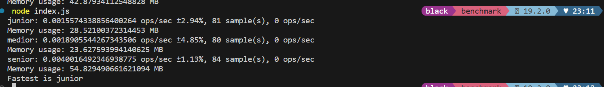
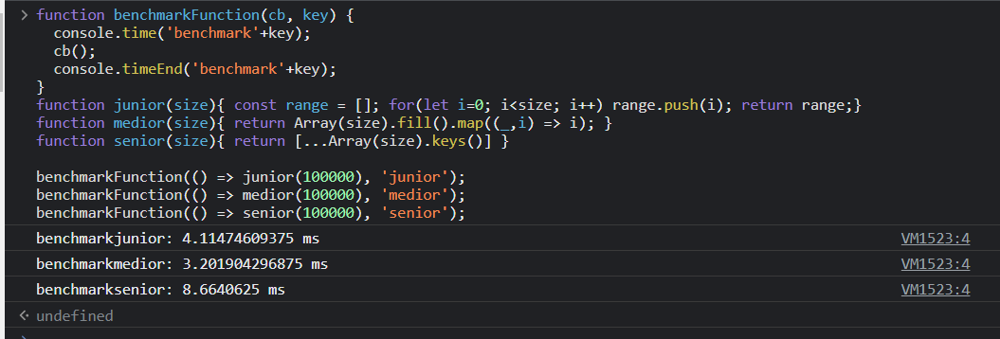

# The Grand JavaScript Seniority Showdown

Welcome one, welcome all! Step right up and see the most thrilling, the most stupendous, the most sensational spectacle of JavaScript performance!

Here we test the mettle of three functions representing three levels of JavaScript coder maturity - the `junior`, the `medior`, and the `senior`.

Will the `senior` justify its title, or will it be toppled by the young and eager `junior`? Find out in this breathtaking contest!

## The Contestants :muscle:

We have three fearless contestants:

1. `junior` - A bit old-school, loves the traditional for loop. It's slow and steady, but will it win the race?
2. `medior` - A little smarter, leverages the `Array.fill().map()` combo. Has a lot to prove today.
3. `senior` - The cool kid, uses the ES6 spread operator with `Array.keys()`. Is it as fast as it is slick? Let's find out!

## The Showdown :boom:

Each function is tasked with creating an array of a whopping 100,000 elements! Who will do it the fastest? Who will use the least memory? 

Our trusty benchmark suite will tell us the truth. No LinkedIn exaggerations here!

## Results :trophy:

Results are announced after each thrilling cycle, with op/sec rates and memory usage. Who will emerge as the fastest? Will the `senior` function be an impostor, or will it live up to its title? 

## Run It Yourself :running:

Fancy a round of benchmarking yourself? Clone this repo and run:

```bash
node benchmark.js
```




Grab your popcorn, sit back, and watch the JavaScript performance showdown unfold!

Note: This repository is intended for fun and learning purposes. In real life, the seniority of a JavaScript developer cannot be determined by how they create a range of numbers. ;)

## Contributing :handshake:

Feel like we're missing some high-level JavaScript chicanery? Stumbled upon some LinkedIn gold that you think needs to be put to the test? Don't hold back! 

Whoever wants to expose a new piece of balderdash, please, feel free to open an issue first to discuss what you'd like to change. Or better yet, just send us a pull request with your update or new benchmark. We can't wait to see what tomfoolery you've got for us!

